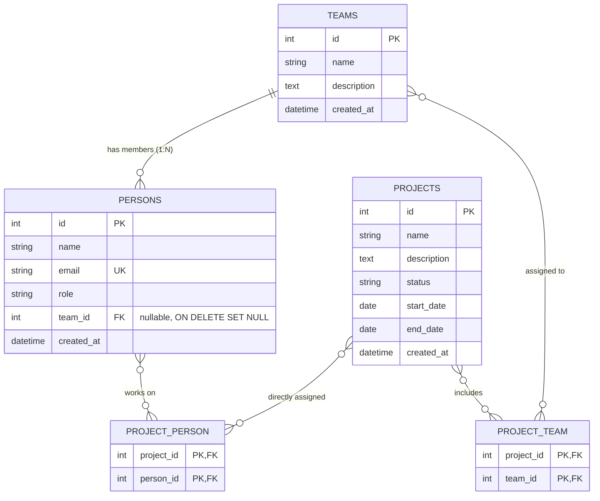

# Project Management System - Backend API

Robust REST API backend for managing projects, persons, and teams, built with **Symfony 6.4 / 7 (PHP 8.2+)**, **Doctrine ORM**, and **SQLite**.

---

## 🌟 Key Features

- **Project Management (CRUD)**: Name, description, status (_Planned / In Progress / Completed / On Hold_), start and end dates.
- **Person Management (CRUD)**: Name, validated unique email, role (_Developer, Analyst, Project Lead, etc._), team and project assignments.
- **Team Concept (Bonus)**: Create and manage working teams, associate persons to teams (1:N), assign teams to projects (M:N).
- **Participant Aggregation**: Automatically calculates all unique project participants (directly assigned persons + members of assigned teams).
- **Data Integrity & Cascades**: Safe entity removal with automatic relationship cleanup.
- **Automatic Initialization**: Auto schema migration and sample data seeding via CLI or REST endpoint.
- **OpenAPI / Swagger 3.0**: Interactive API documentation served live at `/api/doc`.

---

## 🛠️ Tech Stack & Dependencies

- **PHP 8.2+**
- **Symfony Framework (6.4 / 7 LTS)**
- **Doctrine ORM & DBAL** – Relational database management and entity mappings
- **SQLite 3** – Lightweight embedded SQL database
- **NelmioApiDocBundle** – Dynamic OpenAPI 3.0 generation and interactive Swagger UI
- **NelmioCorsBundle** – Configurable CORS headers for frontend integration
- **Symfony Validator** – Strict input validation (email format, required fields, string length)
- **Symfony Serializer** – Entity transformation to JSON

---

## 🗄️ Database Schema (ER Diagram)



---

## 🚀 Running the Application

### 1. Using Docker (Recommended)

From the project root:

```bash
docker compose up --build
```

Or independently within the `backend/` directory:

```bash
docker build -t project-backend .
docker run -p 8000:8000 project-backend
```

The API will be available at: `http://localhost:8000/api`  
Swagger UI documentation: `http://localhost:8000/api/doc`

### 2. Local Setup (Without Docker)

Requirements: PHP >= 8.2 with `pdo_sqlite`, `curl`, `intl`, `zip` extensions and Composer.

```bash
cd backend
composer install
php bin/console app:init-db --seed
php -S 0.0.0.0:8000 -t public
```

---

## 📡 REST API Endpoints Overview

### System & Health

| Method | Endpoint             | Description                          |
| ------ | -------------------- | ------------------------------------ |
| `GET`  | `/api/health`        | Health check and record counts       |
| `POST` | `/api/database/init` | Schema creation and sample data seed |
| `GET`  | `/api/doc`           | Swagger UI documentation             |
| `GET`  | `/api/doc.json`      | Raw OpenAPI 3.0 specification        |

---

### Projects (`/api/projects`)

#### `GET /api/projects`

List all projects. Supports query parameters `?search=portal` and `?status=In%20Progress`.

**Sample Response (200 OK):**

```json
{
  "success": true,
  "count": 1,
  "data": [
    {
      "id": 1,
      "name": "Information Portal & Data Warehouse",
      "description": "Comprehensive modernization of internal project reporting",
      "status": "In Progress",
      "startDate": "2026-01-15",
      "endDate": "2026-12-31",
      "directPersonsCount": 2,
      "teamsCount": 1,
      "totalParticipantsCount": 4,
      "createdAt": "2026-01-15T08:00:00+00:00"
    }
  ]
}
```

#### `GET /api/projects/{id}`

Project detail including directly assigned persons, teams, and deduplicated allParticipants.

#### `POST /api/projects`

Create a new project.

**Sample Request:**

```json
{
  "name": "Security Audit & Infrastructure Hardening",
  "description": "Vulnerability assessment and zero-trust perimeter implementation",
  "status": "Planned",
  "startDate": "2026-05-01",
  "endDate": "2026-11-30",
  "personIds": [1, 2],
  "teamIds": [1]
}
```

#### `PUT /api/projects/{id}`

Update an existing project and its person/team assignments.

#### `DELETE /api/projects/{id}`

Delete a project (safely removes relationship records).

#### `POST /api/projects/{id}/persons/{personId}` / `DELETE /api/projects/{id}/persons/{personId}`

Assign or remove a direct person assignment.

#### `POST /api/projects/{id}/teams/{teamId}` / `DELETE /api/projects/{id}/teams/{teamId}`

Assign or remove a team assignment.

---

### Persons (`/api/persons`)

#### `GET /api/persons`

List persons. Supports `?search=john`, `?role=Developer`, `?teamId=1`.

#### `GET /api/persons/{id}`

Person detail including team and assigned projects.

#### `POST /api/persons`

Create a new person.

**Sample Request:**

```json
{
  "name": "Lucas Miller",
  "email": "lucas.miller@example.com",
  "role": "Security Analyst",
  "teamId": 2,
  "projectIds": [1]
}
```

#### `PUT /api/persons/{id}`

Update person profile.

#### `DELETE /api/persons/{id}`

Delete person (unlinks from projects and teams).

---

### Teams (`/api/teams`)

#### `GET /api/teams`

List all teams with member counts. Supports `?search=Core`.

#### `GET /api/teams/{id}`

Team detail including members and assigned projects.

#### `POST /api/teams`

Create a team.

```json
{
  "name": "Cyber Defense Response Team (CERT)",
  "description": "Specialized unit for forensic analysis and incident response",
  "memberIds": [3, 4]
}
```

#### `PUT /api/teams/{id}`

Update team name, description, or member assignments.

#### `DELETE /api/teams/{id}`

Delete team (unlinks members without deleting person records).
