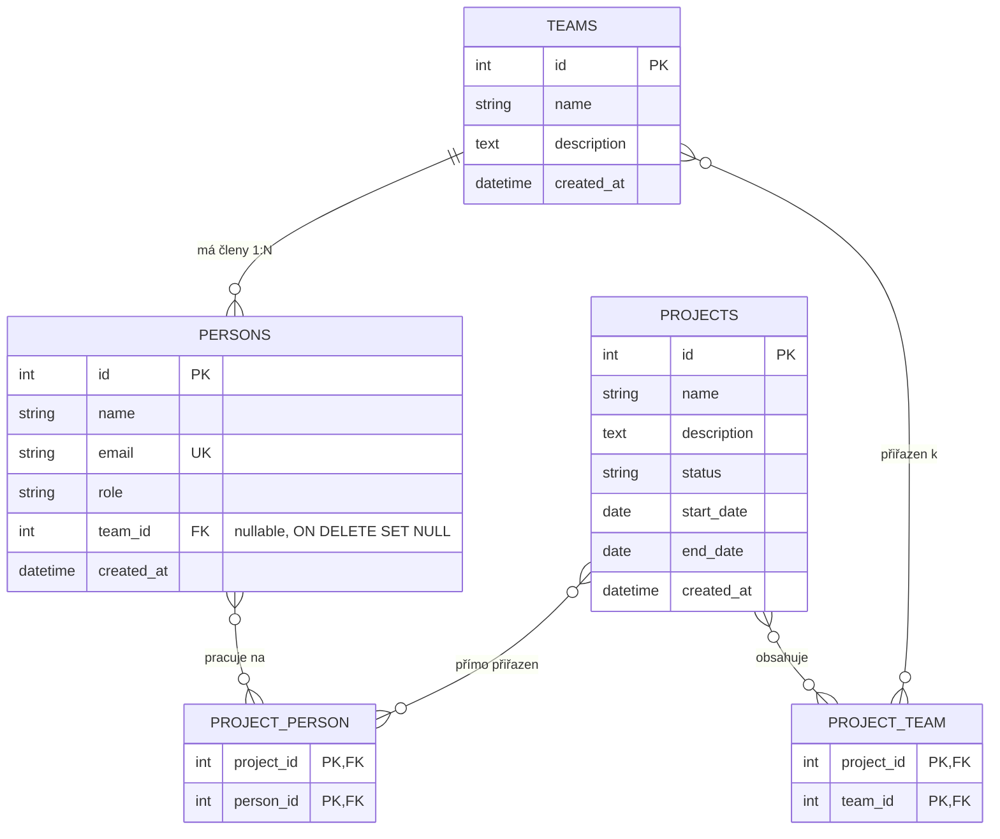

# Backend – Evidence projektů a členů týmů

Tento projekt představuje backendovou část fullstack aplikace pro evidenci projektů, lidí a týmů. Poskytuje **REST API s podporou CRUD operací nad projekty, osobami a týmy**. Aplikace je postavena v PHP na frameworku Symfony, pro práci s daty a objektově-relační mapování využívá Doctrine ORM a jako storage slouží SQLite, což umožňuje jednoduché a rychlé spuštění bez nutnosti konfigurovat externí databázový server.

---

## Přehled systému a architektura

Systém slouží k přehledné evidenci projektů, lidí a jejich zařazení do týmů. Na straně backendu se provádí **základní validace vstupů**, řeší se **ošetření chybových stavů** a standardní **návratové HTTP kódy**. Celá doména je rozdělena do tří hlavních entit: projekty, osoby a týmy.

### Funkcionalita a business logika

- **Projekty**: Eviduje se název, popis, stav (`Planned`, `In Progress`, `Completed`, `On Hold`) a termíny – datum zahájení i volitelné datum dokončení. Validace při vytváření hlídá, aby datum zahájení nebylo v minulosti, a v obou případech kontroluje, aby datum dokončení nepředcházelo datu zahájení (při editaci je historické datum zahájení povoleno).
- **Osoby**: U každého člověka se ukládá jméno, unikátní e-mail a pracovní role (developer, analytik, manažer apod.). Každá osoba může patřit maximálně do jednoho týmu a zároveň mít přímé přiřazení k více projektům.
- **Správa týmů**: Zahrnuje koncept pracovních týmů. Vztah mezi osobou a týmem je 1:N a celé týmy se pak propojují s projekty přes M:N vazbu.
- **Agregace účastníků**: V detailu projektu je implementováno automatické skládání celkového seznamu účastníků. Logika projde přímo přiřazené lidi i členy přiřazených týmů, odstraní duplicity a u každého označí source – direct, team nebo both.
- **Integrita dat a mazání**: Při smazání projektu se vyčistí jen záznamy ve vazebních tabulkách, samotné osoby ani týmy se nemažou. Pokud se smaže tým, jeho členům se nastaví vazba na `NULL` přes `ON DELETE SET NULL`. Při smazání osoby se bezpečně uklidí její vazby na projekty i členství v týmu.

### Validace vstupů a návratové HTTP kódy

Na straně backendu je implementována důsledná validace příchozích dat i jednotné ošetření chybových stavů:

1. **Validace vstupů**:
   - Využívá Symfony Validator s validačními atributy (`#[Assert\NotBlank]`, `#[Assert\Email]`, `#[Assert\Choice]`, `#[Assert\Length]`) přímo na entitách i vlastní validační callbacky (`#[Assert\Callback]`).
   - Kontrolují se povinná pole (název projektu, jméno, e-mail, role), formát a unikátnost e-mailu (včetně zamezení duplicity v databázi), povolené stavy projektů a časové relace termínů (při zakládání projektu nesmí být datum zahájení v minulosti a datum ukončení nesmí předcházet datu zahájení).

2. **Návratové HTTP kódy**:
   - `200 OK`: Úspěšné načtení dat (`GET`), úprava existujícího záznamu (`PUT`) nebo smazání entity (`DELETE`).
   - `201 Created`: Úspěšné vytvoření nového projektu, osoby nebo týmu (`POST`) – response vrací nově vytvořenou entitu včetně vygenerovaného ID.
   - `400 Bad Request`: Nevalidní vstupní JSON payload nebo neprošlá validace – response vrací strukturovaný JSON s mapou nevalidních polí a chybových hlášek (`{"success": false, "errors": {"field": "message"}}`).
   - `404 Not Found`: Požadovaný záznam podle ID v databázi neexistuje (`{"success": false, "message": "Resource not found"}`).
   - `409 Conflict`: Konflikt v datech, např. pokus o vytvoření či úpravu osoby s e-mailem, který již v systému existuje.
   - `500 Internal Server Error`: Neočekávaná výjimka na straně serveru.

---

## Databázové schéma

Relační schéma využívá dvě vazební tabulky pro M:N relace:



---

## Použité technologie a tech stack

- **PHP 8.2+**: Moderní syntaxe a language features jako atributy, typed properties nebo union types.
- **Symfony 6.4 / 7 LTS**:
  - `FrameworkBundle`: Routing, dependency injection kontejner a request handling.
  - `Validator`: Validace příchozích JSON payloadů pomocí atributů přímo na entitách.
  - `Serializer`: Serializace entit a polí do JSON response.
  - `Console`: CLI commandy pro správu databáze a seedování dat.
- **Doctrine ORM & DBAL**: Mapování objektů na relační tabulky, migrace a správa relací.
- **SQLite 3**: Lehká relační databáze v souboru `var/data.db`, v Dockeru persistovaná přes pojmenovaný volume.
- **NelmioApiDocBundle**: Automaticky generuje OpenAPI 3.0 specifikaci a interaktivní Swagger UI pro testování endpointů přímo z browseru.
- **NelmioCorsBundle**: Handling CORS hlaviček pro bezproblémové volání API z frontendu.
- **Docker & Docker Compose**: Kontejnerizace celého backendu s automatickým seedováním DB při prvním spuštění.

---

## Struktura projektu

```
backend/
├── bin/console                      # Symfony konzole
├── config/                          # Konfigurace balíčků a services
├── public/index.php                 # Entrypoint aplikace
├── src/
│   ├── Command/
│   │   └── InitDatabaseCommand.php  # CLI command app:init-db pro sestavení schématu a seed dat
│   ├── Controller/
│   │   ├── BaseApiController.php    # Společný controller s helpery pro JSON response a validace
│   │   ├── DatabaseController.php   # Healthcheck a endpoint pro reset a re-seed DB
│   │   ├── PersonController.php     # API endpointy pro správu osob a vazeb
│   │   ├── ProjectController.php    # API endpointy pro projekty a přiřazování účastníků
│   │   └── TeamController.php       # API endpointy pro týmy a členy
│   ├── Entity/                      # Doctrine entity Project, Person, Team
│   ├── Repository/                  # Repozitáře pro optimalizované databázové queries
│   └── Kernel.php                   # Symfony Kernel
├── Dockerfile                       # Dockerfile pro backend image
├── docker-compose.yml               # Compose konfigurace pro lokální dev
└── docker-entrypoint.sh             # Entrypoint skript s automatickou inicializací DB
```

---

## Setup a jak aplikaci spustit

### Spuštění přes Docker Compose

Pokud máte nainstalovaný Docker, stačí spustit:

```bash
cd backend
docker compose up --build
```

Kontejner při startu automaticky ověří existenci databáze. Pokud databáze ještě neexistuje, vytvoří schéma tabulek a naplní je výchozími testovacími daty.

Běžící API a dokumentace jsou dostupné na:

- REST API: `http://localhost:8000/api`
- Swagger UI s interaktivní dokumentací: `http://localhost:8000/api/doc`
- OpenAPI JSON schéma: `http://localhost:8000/api/doc.json`
- Healthcheck: `http://localhost:8000/api/health`

Vypnutí kontejneru:

```bash
docker compose down
```

### Spuštění lokálně bez Dockeru

Požadavky: PHP 8.2+ s rozšířeními `pdo_sqlite`, `curl`, `intl`, `mbstring`, `zip`, `xml` a Composer.

1. Instalace balíčků:

   ```bash
   cd backend
   composer install
   ```

2. Příprava `.env` souboru:

   ```bash
   cp .env .env.local
   ```

3. Vytvoření databáze a naplnění vzorovými daty:

   ```bash
   php bin/console app:init-db --seed
   ```

4. Spuštění lokálního serveru:
   ```bash
   php -S 0.0.0.0:8000 -t public
   ```
   Backend poběží na `http://localhost:8000`.

---

## Přehled REST API endpointů

### Systém

| Metoda | Endpoint             | Popis                                                                                                     |
| :----- | :------------------- | :-------------------------------------------------------------------------------------------------------- |
| `GET`  | `/api/health`        | Kontrola funkčnosti API a počty záznamů                                                                   |
| `POST` | `/api/database/init` | Vyčištění a reinicializace databáze s testovacími daty – dostupné i přes reset button v patičce frontendu |
| `GET`  | `/api/doc`           | Swagger UI rozhraní v prohlížeči                                                                          |
| `GET`  | `/api/doc.json`      | OpenAPI 3.0 specifikace v JSON                                                                            |

Ukázka z `/api/health`:

```json
{
  "status": "OK",
  "service": "Project Management REST API",
  "database": "connected",
  "stats": {
    "projects": 4,
    "persons": 6,
    "teams": 3
  },
  "timestamp": "2026-10-05T12:00:00+00:00"
}
```

---

### Projekty – `/api/projects`

| Metoda   | Endpoint                                | Popis                                         |
| :------- | :-------------------------------------- | :-------------------------------------------- |
| `GET`    | `/api/projects`                         | Seznam projektů s filtry `search` a `status`  |
| `GET`    | `/api/projects/{id}`                    | Detail projektu včetně dopočítaných účastníků |
| `POST`   | `/api/projects`                         | Vytvoření nového projektu                     |
| `PUT`    | `/api/projects/{id}`                    | Úprava projektu a vazeb                       |
| `DELETE` | `/api/projects/{id}`                    | Smazání projektu                              |
| `POST`   | `/api/projects/{id}/persons/{personId}` | Přímé přiřazení osoby k projektu              |
| `DELETE` | `/api/projects/{id}/persons/{personId}` | Odebrání osoby z projektu                     |
| `POST`   | `/api/projects/{id}/teams/{teamId}`     | Přiřazení celého týmu k projektu              |
| `DELETE` | `/api/projects/{id}/teams/{teamId}`     | Odebrání týmu z projektu                      |

Ukázka založení projektu – `POST /api/projects`:

```json
{
  "name": "Klientský portál",
  "description": "Nové webové rozhraní a platební brána",
  "status": "Planned",
  "startDate": "2026-11-01",
  "endDate": "2027-04-30",
  "personIds": [1, 2],
  "teamIds": [1]
}
```

Ukázka odpovědi detailu projektu – `GET /api/projects/1`:

```json
{
  "success": true,
  "data": {
    "id": 1,
    "name": "Klientský portál",
    "description": "Nové webové rozhraní a platební brána",
    "status": "Planned",
    "startDate": "2026-11-01",
    "endDate": "2027-04-30",
    "directPersonsCount": 2,
    "teamsCount": 1,
    "totalParticipantsCount": 3,
    "createdAt": "2026-10-05T10:00:00+00:00",
    "persons": [
      {
        "id": 1,
        "name": "Jan Novák",
        "email": "jan.novak@example.cz",
        "role": "Architekt"
      },
      {
        "id": 2,
        "name": "Petr Svoboda",
        "email": "petr.svoboda@example.cz",
        "role": "Frontend vývojář"
      }
    ],
    "teams": [{ "id": 1, "name": "Web Core Team", "membersCount": 2 }],
    "allParticipants": [
      {
        "id": 1,
        "name": "Jan Novák",
        "email": "jan.novak@example.cz",
        "role": "Architekt",
        "assignmentType": "both",
        "viaTeam": { "id": 1, "name": "Web Core Team" }
      },
      {
        "id": 2,
        "name": "Petr Svoboda",
        "email": "petr.svoboda@example.cz",
        "role": "Frontend vývojář",
        "assignmentType": "direct"
      },
      {
        "id": 3,
        "name": "Eva Dvořáková",
        "email": "eva.dvorakova@example.cz",
        "role": "Backend vývojář",
        "assignmentType": "team",
        "viaTeam": { "id": 1, "name": "Web Core Team" }
      }
    ]
  }
}
```

---

### Osoby – `/api/persons`

| Metoda   | Endpoint            | Popis                                            |
| :------- | :------------------ | :----------------------------------------------- |
| `GET`    | `/api/persons`      | Seznam osob s filtry `search`, `role` a `teamId` |
| `GET`    | `/api/persons/{id}` | Detail osoby včetně týmu a řešených projektů     |
| `POST`   | `/api/persons`      | Vytvoření nové osoby                             |
| `PUT`    | `/api/persons/{id}` | Úprava údajů osoby nebo změna týmu               |
| `DELETE` | `/api/persons/{id}` | Smazání osoby                                    |

Ukázka vytvoření osoby – `POST /api/persons`:

```json
{
  "name": "Michal Kovář",
  "email": "michal.kovar@example.cz",
  "role": "Tester",
  "teamId": 1,
  "projectIds": [1]
}
```

---

### Týmy – `/api/teams`

| Metoda   | Endpoint          | Popis                                           |
| :------- | :---------------- | :---------------------------------------------- |
| `GET`    | `/api/teams`      | Seznam týmů s počty členů a projektů            |
| `GET`    | `/api/teams/{id}` | Detail týmu včetně členů a přiřazených projektů |
| `POST`   | `/api/teams`      | Založení nového týmu                            |
| `PUT`    | `/api/teams/{id}` | Úprava týmu a nastavení členské základny        |
| `DELETE` | `/api/teams/{id}` | Smazání týmu                                    |

Ukázka vytvoření týmu – `POST /api/teams`:

```json
{
  "name": "Infrastruktura a provoz",
  "description": "Správa serverů a automatizace nasazení",
  "memberIds": [4, 5]
}
```

---

## Poznámka k vývoji

Při vývoji tohoto projektu jsem jako asistenta využíval umělou inteligenci, kterou jsem aktivně promptoval, moderoval a usměrňoval.
